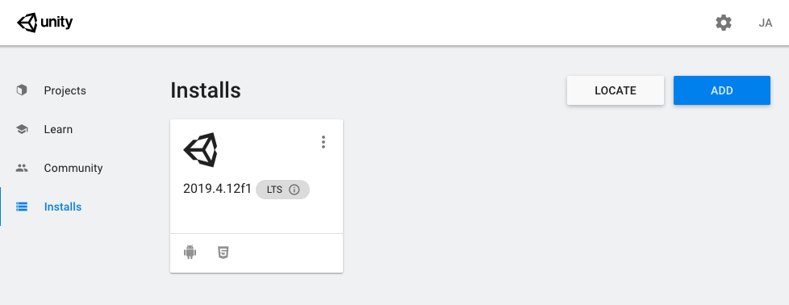
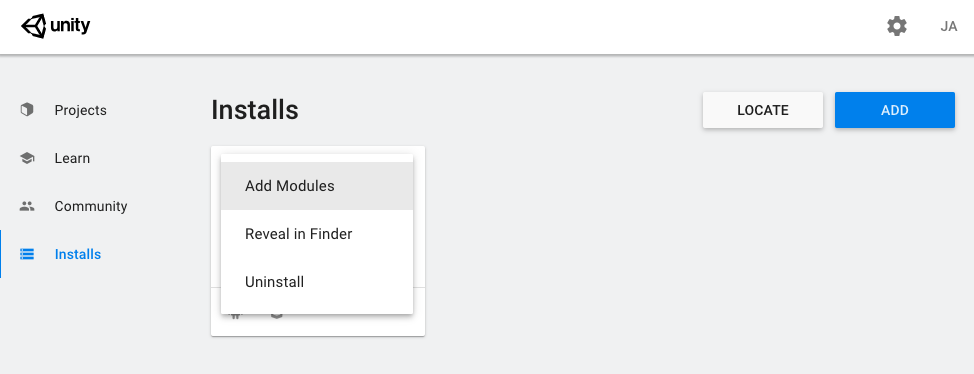
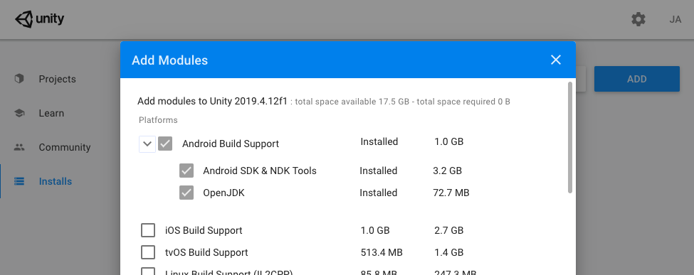
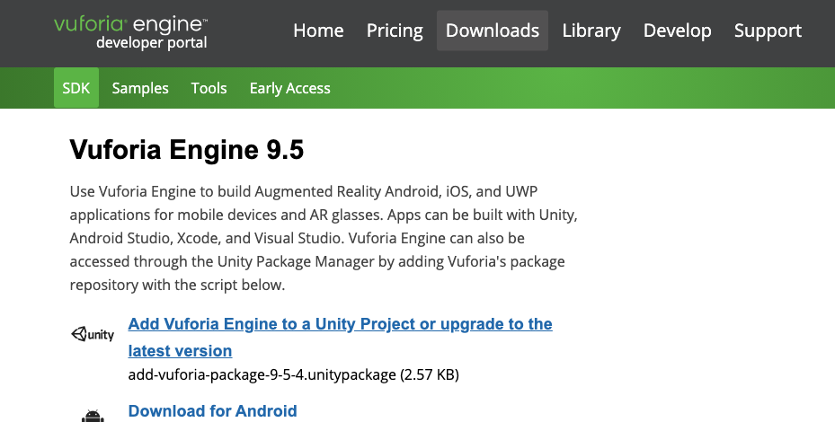

# CA1 Setup Guide

1. Ensure that you have unity hub installed

    If not: Go to [Unity Hub Download Website](https://unity3d.com/get-unity/download) and download Unity Hub.

2. Install the latest recommended Unity
3. Include Visual Studios Community & Android Build Support
4. If everything is installed successfully, you should have the following:

    
    > Note: The Android icon will be there if you installed Android Build Support.

5. If you missed the Android Build Support (Or would like to double check), Click on the 3 dots on the top right of your Unity Version, and choose `Add Module`

    

6. Ensure that the following is checked, if it was already checked (& Grey) this means that it has already been added, otherwise, go ahead and check them and then click install

    

7. Double check one last time that you have installed
   1. Visual Studios (check your applications)
   2. Unity
   3. Android Build Support

    

8. Install the Vuforia SDK to be added into the project that you want to use Vuforia.

    Go to the [vuforia SDK download page](https://developer.vuforia.com/downloads/sdk) and choose `Add Vuforia Engine to a Unity Project...`

    

9. You will run this unitypackage file to add it in to your project, if you have yet create the project, there's nothing to add to.

10. Ensure that you have indeed downloaded the following files
    1.  Visual Studios (check your applications)
    2.  Unity (Check via Unity Hub)
    3.  Android Build Support (Check for the Android icon below your Unity Version)
    4.  Vuforia SDK (Check for the unitypackage file in your downloads) (Well... you can always download them again in the future if you need it)
